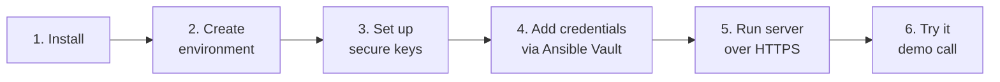

# Catalyst Center IAC MCP Server

A FastMCP server that exposes Cisco Catalyst Center automation as secure MCP tools
for AI agents. It runs the `cisco.catalystcenter` Ansible collection through
`ansible-runner`, tracks work as async tasks in Redis, and serves everything over
**HTTPS with API-key authentication**.

## What it does

- **70 MCP tools** for Catalyst Center workflows (sites, SD-Access fabric,
  provisioning, assurance, discovery, inventory, and more)
- **Async task execution** with Redis persistence and artifact tracking
- **Multi-cluster support** through a YAML catalog
- **Secure by default** — HTTPS + API key, with credentials protected by Ansible Vault

## Contents

- [Secure golden path](#secure-golden-path) — the 6 steps to a running server
- [Tools](#tools) · [Endpoints](#endpoints) · [Architecture](#architecture)
- [Configuration reference](#configuration-reference)
- [Running and deployment](#running-and-deployment) — CLI, systemd, NGINX, Docker
- [Other platforms](#other-platforms) — macOS, Debian, RHEL, WSL2, dev
- [Multiple Catalyst Centers](#multiple-catalyst-centers)
- [Ansible Vault details](#ansible-vault-details)
- [Troubleshooting](#troubleshooting) · [Support](#support) · [License](#license)

> **New here?** Follow the six steps below from top to bottom. They take you from a
> clean machine to a running, authenticated, HTTPS server.

---

## Secure golden path



### Requirements

- **OS:** Linux (recommended) or macOS. On Windows, use WSL2 or Docker — see
  [Other platforms](#other-platforms).
- **Python:** 3.11 or higher
- **Redis:** 6.0 or higher (`redis-cli ping` returns `PONG`)
- **Ansible collection:** `cisco.catalystcenter` 2.6.0+ (installed in Step 2)
- **Network:** reachability to your Cisco Catalyst Center instance

### 1. Install

```bash
git clone https://github.com/cisco-en-programmability/catalyst_center_iac_mcpserver.git
cd catalyst_center_iac_mcpserver
```

### 2. Create the environment

Create a virtual environment and install the server, the Ansible runtime, and the
collection:

```bash
python3 -m venv .venv
source .venv/bin/activate          # Windows (WSL2) uses the same command

pip install --upgrade pip setuptools wheel
pip install "ansible-core>=2.16,<2.19"
pip install .

ansible-galaxy collection install -r requirements.yml
```

Create your **non-secret** configuration file. Secrets (passwords, API keys) are
added later in Step 4, so leave them out here:

```bash
cp deploy/env/catalyst-center-iac-mcp.env.example .env
```

Edit `.env` and set the non-secret values. Keep `HTTPS_ONLY=true`:

```bash
CATALYSTCENTER_HOST=your-catalyst-center.example.com
CATALYSTCENTER_USERNAME=automation
CATALYSTCENTER_VERSION=2.6.0
CATALYSTCENTER_VERIFY_SSL=false

REDIS_URL=redis://127.0.0.1:6379/0
SERVER_HOST=127.0.0.1
SERVER_PORT=8443
HTTPS_ONLY=true
```

The server auto-loads `.env`. **Do not** put `CATALYSTCENTER_PASSWORD` or
`API_KEYS` in this file — they go into the vault in Step 4.

### 3. Set up secure keys

The server requires TLS (`HTTPS_ONLY=true` is the default) and rejects requests
without a valid API key when API-key auth is enabled.

**a. TLS certificate.** Use a certificate from your PKI/Let's Encrypt in
production. For a lab, generate a self-signed certificate:

```bash
mkdir -p deploy/certs
openssl req -x509 -newkey rsa:4096 -nodes \
  -keyout deploy/certs/privkey.pem \
  -out deploy/certs/fullchain.pem \
  -days 365 -subj "/CN=localhost"
```

Point `.env` at the certificate and enable API-key auth:

```bash
TLS_CERTFILE=deploy/certs/fullchain.pem
TLS_KEYFILE=deploy/certs/privkey.pem
API_KEY_ENABLED=true
```

**b. API key.** Generate a strong key and copy the value — you'll store it in the
vault in the next step:

```bash
python3 -c "import secrets; print(secrets.token_urlsafe(32))"
```

### 4. Add credentials via Ansible Vault

Keep the Catalyst Center password and API key **encrypted at rest**. (Full
reference in [Ansible Vault details](#ansible-vault-details).)

```bash
# One-time: create a vault password, readable only by you
mkdir -p ~/.config/catalyst-center-iac-mcp
openssl rand -base64 32 > ~/.config/catalyst-center-iac-mcp/.vault_pass
chmod 600 ~/.config/catalyst-center-iac-mcp/.vault_pass

# Put your secrets in a file (use the API key you generated in Step 3)
cat > secrets.env << 'EOF'
CATALYSTCENTER_PASSWORD=your-catalyst-center-password
API_KEYS=your-generated-api-key
EOF

# Encrypt it — the plaintext is now gone from disk
ansible-vault encrypt secrets.env \
  --vault-password-file ~/.config/catalyst-center-iac-mcp/.vault_pass
```

`secrets.env` is now ciphertext. Keep it out of version control.

### 5. Run the server over HTTPS

Decrypt the secrets into memory, export them, and start the server. The server
already reads the rest of its config from `.env`:

```bash
set -a
source <(ansible-vault view secrets.env \
  --vault-password-file ~/.config/catalyst-center-iac-mcp/.vault_pass)
set +a

catalyst-center-iac-mcp
```

The server is now available at `https://127.0.0.1:8443`.

Verify it (use your API key; `-k` accepts the self-signed lab certificate):

```bash
export API_KEY="your-generated-api-key"
curl -k https://127.0.0.1:8443/healthz -H "X-API-Key: $API_KEY"
# {"status": "ok", "subject": "apikey:..."}
```

### 6. Try it (demo)

The server from Step 5 runs in the foreground, so **open a new terminal** for the
demo. It performs a secure health check and lists your configured Catalyst Centers.

**Linux / macOS / WSL2 / Git Bash (bash):**

```bash
export MCP_URL="https://127.0.0.1:8443"
export API_KEY="your-generated-api-key"
chmod +x scripts/demo.sh      # first time only
./scripts/demo.sh
```

**Windows (PowerShell):**

```powershell
$env:MCP_URL = "https://127.0.0.1:8443"
$env:API_KEY = "your-generated-api-key"
./scripts/demo.ps1
```

Or make the same authenticated tool call directly:

```bash
curl -k -X POST https://127.0.0.1:8443/mcp \
  -H "Content-Type: application/json" \
  -H "X-API-Key: $API_KEY" \
  -d '{
    "jsonrpc": "2.0",
    "id": 1,
    "method": "tools/call",
    "params": { "name": "list_catalyst_centers", "arguments": {} }
  }'
```

Register the server with an MCP client (for example Claude Desktop) by pointing it
at the HTTPS endpoint:

```json
{
  "mcpServers": {
    "catalyst-center": {
      "url": "https://your-hostname:8443/mcp",
      "transport": "http"
    }
  }
}
```

---

## Tools

The server exposes **70 tools** in three groups:

- **Direct tools (3)** — simplified interfaces: `provision_site`, `delete_site`,
  `configure_network_settings`.
- **Workflow tools (38)** — full control per module (site management, ISE/AAA,
  templates, PnP, wireless, network profiles, assurance, application policy,
  discovery, inventory, provisioning, reports, SD-Access fabric, LAN automation, RMA).
- **Config generators (29)** — read-only tools (`<domain>_config`) that query
  current state and default to `state: gathered`.

Call `tools/list` on the running server, or see [tool_catalog.yaml](tool_catalog.yaml),
for the complete inventory.

### Selecting a Catalyst Center

Most tools accept a target selector:

- **`catalyst_center`** — pick a cluster from
  [catalyst_center_clusters.yaml](catalyst_center_clusters.yaml) by name, label,
  location, or host.
- **`tenant_id`** — legacy tenant-scoped environment variable routing.

If both are given, `catalyst_center` wins. If neither is given, the enabled cluster
marked `default: true` is used. See [Multiple Catalyst Centers](#multiple-catalyst-centers).

## Endpoints

- `GET /healthz` — health check
- `POST /mcp` — MCP protocol endpoint
- `GET /iactasks/get/{task_id}` — task status
- `GET /iactasks/get/{task_id}/logs` — task logs and artifacts

Long operations return a task ID; poll `/iactasks/get/{task_id}` for progress, or
use the `get_iac_task` and `get_task_stdout` tools.

## Architecture

- `FastMCP` — MCP tool registration and request handling
- `FastAPI` — HTTP app for `/mcp`, `/healthz`, and `/iactasks/get/{task_id}`
- `ansible-runner` — the only execution path for Catalyst Center operations
- `Redis` — task state, progress, results, and artifact indexing

The server is stateless by design; Redis and runner artifacts hold operational
state, which makes multi-instance deployment practical.

---

## Configuration reference

The golden path above sets only what you need. This is the full variable reference.

### Catalyst Center credentials

```bash
CATALYSTCENTER_HOST=catalyst-center.example.com
CATALYSTCENTER_USERNAME=automation
CATALYSTCENTER_PASSWORD=change-me          # keep in the vault, not in .env
CATALYSTCENTER_VERIFY_SSL=false
CATALYSTCENTER_PORT=443
CATALYSTCENTER_VERSION=2.6.0
```

### Server and TLS

```bash
SERVER_HOST=127.0.0.1
SERVER_PORT=8443
SERVER_WORKERS=2
HTTPS_ONLY=true                            # server refuses to start without TLS files
PROXY_HEADERS=true
FORWARDED_ALLOW_IPS=127.0.0.1

TLS_CERTFILE=deploy/certs/fullchain.pem
TLS_KEYFILE=deploy/certs/privkey.pem
# TLS_CA_CERTS=/etc/ssl/certs/ca-certificates.crt

REDIS_URL=redis://127.0.0.1:6379/0
RUNNER_ARTIFACT_ROOT=/var/lib/catalyst-center-iac-mcp/artifacts
RUNNER_TIMEOUT_SECONDS=3600
TASK_TTL_SECONDS=86400

MCP_PATH=/mcp
MCP_TRANSPORT=http
MCP_STATELESS_HTTP=true                    # correct for app-level MCP registrations
CATALYST_CENTER_CLUSTERS_FILE=./catalyst_center_clusters.yaml
```

`HTTPS_ONLY=true` is the default; the server will not start unless `TLS_CERTFILE`
and `TLS_KEYFILE` are set. Set `HTTPS_ONLY=false` only for local development behind
another TLS terminator.

`MCP_STATELESS_HTTP=true` is correct for app-level MCP registrations. Set it to
`false` only if your client supports user-specific MCP sessions.

> For the `reports` workflow tool, each `generate_report` entry must include a
> non-empty `view` field. If the view is unknown, ask the user to choose it rather
> than guessing.

### Authentication

API-key authentication is the recommended mode and the default in the golden path.

```bash
API_KEY_ENABLED=true
API_KEYS=key1_abc123,key2_xyz789           # comma-separated; keep in the vault
API_KEY_HEADER=X-API-Key                   # optional custom header name
```

Generate keys with `python3 -c "import secrets; print(secrets.token_urlsafe(32))"`
and use a different key per client so they can be rotated independently. Full guide:
[docs/API_KEY_AUTHENTICATION.md](docs/API_KEY_AUTHENTICATION.md).

OAuth (JWT) is also supported for enterprise SSO:

```bash
OAUTH_ENABLED=true
OAUTH_ISSUER=https://auth.example.com
OAUTH_AUDIENCE=catalyst-center-mcp
OAUTH_JWKS_URL=https://auth.example.com/.well-known/jwks.json
```

> Anonymous (no-auth) access and plain HTTP are for local development only and are
> intentionally not documented as a supported flow. Always run with TLS and either
> API-key or OAuth authentication in shared or production environments.

### Version fallback

The server normalizes Catalyst Center versions to the nearest supported release:

- **2.3.7.10** or **2.3.7** normalize to **2.3.7.9**
- **3.1.3.1** or **3.1.3.7** normalize to **3.1.3.6**
- Unsupported versions remain unchanged

Any version within the same major.minor.patch family works with the nearest
supported version.

---

## Running and deployment

### CLI

```bash
. /opt/catalyst-center-iac-mcp/.venv/bin/activate
export $(grep -v '^#' /etc/catalyst-center-iac-mcp/catalyst-center-iac-mcp.env | xargs)
catalyst-center-iac-mcp
```

### Recommended production topology

Run the app on `127.0.0.1:8000`, NGINX (or another reverse proxy) for HTTPS
termination, and systemd for process supervision. Provided examples:

- systemd unit: [deploy/systemd/catalyst-center-iac-mcp.service](deploy/systemd/catalyst-center-iac-mcp.service)
- NGINX config: [deploy/nginx/catalyst-center-iac-mcp.conf](deploy/nginx/catalyst-center-iac-mcp.conf)

### systemd

```bash
sudo cp deploy/env/catalyst-center-iac-mcp.env.example /etc/catalyst-center-iac-mcp/catalyst-center-iac-mcp.env
sudo vi /etc/catalyst-center-iac-mcp/catalyst-center-iac-mcp.env

sudo cp deploy/systemd/catalyst-center-iac-mcp.service /etc/systemd/system/
sudo systemctl daemon-reload
sudo systemctl enable --now catalyst-center-iac-mcp
sudo systemctl status catalyst-center-iac-mcp
```

### NGINX (HTTPS reverse proxy)

```bash
sudo cp deploy/nginx/catalyst-center-iac-mcp.conf /etc/nginx/conf.d/
sudo nginx -t
sudo systemctl reload nginx
curl https://mcp.example.com/healthz
```

Important for MCP/SSE: keep proxy buffering **disabled** on `/mcp/`, set a large
`proxy_read_timeout` for long jobs, and pass `X-Forwarded-Proto` through.

### Docker

```bash
docker build -t catalyst-center-iac-mcp .

docker run -d --name catalyst-center-iac-mcp -p 8000:8000 \
  -e SERVER_HOST=0.0.0.0 -e SERVER_PORT=8000 \
  -e REDIS_URL=redis://redis:6379/0 \
  -e CATALYSTCENTER_HOST=catalyst-center.example.com \
  -e CATALYSTCENTER_USERNAME=automation \
  -e CATALYSTCENTER_PASSWORD=change-me \
  -e CATALYSTCENTER_VERSION=2.6.0 \
  -v /var/lib/catalyst-center-iac-mcp:/var/lib/catalyst-center-iac-mcp \
  catalyst-center-iac-mcp
```

Put the container behind NGINX, Caddy, HAProxy, or a Kubernetes ingress for HTTPS.

### Docker Compose HTTPS stack

For a single host with Redis + app + NGINX HTTPS termination, use
[compose.yaml](compose.yaml):

```bash
cp deploy/env/catalyst-center-iac-mcp.env.example deploy/env/catalyst-center-iac-mcp.env
vi deploy/env/catalyst-center-iac-mcp.env

# Place TLS files at deploy/certs/fullchain.pem and deploy/certs/privkey.pem
docker compose up -d --build
docker compose ps
curl https://your-hostname/healthz
```

NGINX disables proxy buffering for `/mcp/` so HTTP/SSE transport stays usable.

> For local development only, `compose.dev.yaml` runs Redis and the app over plain
> HTTP without NGINX/TLS. Do not use it for production.

---

## Other platforms

Steps 2–6 of the golden path are identical everywhere. Only the OS prerequisites
differ. Install the prerequisites below, then follow the golden path from Step 2.

**macOS**

```bash
brew install python@3.11 redis
brew services start redis
```

**Ubuntu / Debian**

```bash
sudo apt update
sudo apt install -y python3 python3-venv python3-pip redis-server git
sudo systemctl enable --now redis-server
```

**RHEL / CentOS / Rocky Linux**

```bash
sudo dnf install -y epel-release
sudo dnf install -y python3.11 python3.11-pip redis git
sudo systemctl enable --now redis
```

**Windows** — native Windows is **not supported** (`ansible-runner` needs Unix-only
APIs). Use WSL2 (`wsl --install -d Ubuntu`, then follow the Ubuntu steps) or the
[Docker](#docker) deployment.

**Development** — install the dev extras and run the tests:

```bash
pip install -e ".[dev]"
pytest
```

---

## Multiple Catalyst Centers

Define clusters in [catalyst_center_clusters.yaml](catalyst_center_clusters.yaml)
and target them by `name`, `label`, `location`, or `host`. Mark exactly one enabled
cluster with `default: true` so calls that omit `catalyst_center` use it.

```yaml
catalyst_centers:
  - name: "Portland"
    label: "dev"
    host: "Portland-center.domain.com"
    version: "3.1.3.0"
    location: "Portland"
    enabled: true
    default: true
  - name: "San Jose"
    label: "production"
    host: "SanJose-catalyst.domain.com"
    version: "2.3.7.9"
    location: "San Jose"
    enabled: false
```

Credentials stay in environment variables (keep the passwords in the vault). For a
cluster with label `dev`:

```bash
CC_DEV_USERNAME=svc-dev
CC_DEV_PASSWORD=dev-secret
CC_DEV_VERIFY_SSL=false
CC_DEV_PORT=443
CC_DEV_VERSION=3.1.3.0
```

Then pass `catalyst_center="Portland"` or `catalyst_center="dev"` in a tool call.
The older `CATALYSTCENTER_CLUSTER_*` variable names are still accepted.

**Multi-tenant (legacy).** Tenant-scoped routing also works — set
`CATALYSTCENTER_ACME_HOST`, `CATALYSTCENTER_ACME_USERNAME`,
`CATALYSTCENTER_ACME_PASSWORD`, etc., then pass `tenant_id="acme"` in a tool call.

**Routing rules.** `catalyst_center` takes precedence over `tenant_id`. If
`catalyst_center` is omitted, the `default: true` cluster is used; if there is no
default but exactly one enabled cluster, that one is used. Use `list_catalyst_centers`
to inspect the inventory.

---

## Ansible Vault details

Step 4 encrypts credentials at rest. This section covers editing, rotation, and the
security rationale.

**How it works.** The server reads credentials from environment variables at
runtime. Ansible Vault encrypts the file that holds those values on disk; at start
time you decrypt in memory (`ansible-vault view`), export the variables, and launch
the server, so plaintext secrets never persist on disk.

**Edit or rotate:**

```bash
# Edit in place (opens $EDITOR decrypted, re-encrypts on save)
ansible-vault edit secrets.env \
  --vault-password-file ~/.config/catalyst-center-iac-mcp/.vault_pass

# Rotate the vault password itself
ansible-vault rekey secrets.env \
  --vault-password-file ~/.config/catalyst-center-iac-mcp/.vault_pass
```

After rotating a Catalyst Center password or API key, edit the vaulted file and
restart the server so the new value is loaded.

**Security notes:**

- Never decrypt secrets to a file on disk; always stream via `ansible-vault view`.
- Keep the vault password file at `chmod 600`, owned by the service account.
- In CI/CD, provide the vault password from a masked secret, not a committed file.
- Add `secrets.env`, `.env`, and `.vault_pass` to `.gitignore`.
- Do not print secrets in logs, `set -x` traces, or CI output.

---

## Troubleshooting

- **Server won't start / TLS error:** `HTTPS_ONLY=true` requires `TLS_CERTFILE` and
  `TLS_KEYFILE`. Set them (Step 3) or use `HTTPS_ONLY=false` for local HTTP only.
- **401 / missing key:** send `-H "X-API-Key: $API_KEY"` with a key that is present
  in `API_KEYS`.
- **Missing tools:** reinstall the collection —
  `ansible-galaxy collection install cisco.catalystcenter:==2.6.0 --force`.
- **Redis errors:** ensure Redis is running (`redis-cli ping`).
- **Connection issues:** verify Catalyst Center reachability and credentials.

## More documentation

- [API key authentication](docs/API_KEY_AUTHENTICATION.md) — full auth guide
- [Module dependencies](MODULE_DEPENDENCIES.md) — required inputs per workflow
- [Schema-driven architecture](SCHEMA_DRIVEN_ARCHITECTURE.md) — tool registry design
- [Examples](examples) — working Python samples
- [Contributing](CONTRIBUTING.md) · [Changelog](CHANGELOG.md)

## Support

For the certified `cisco.catalystcenter` collection on Red Hat Automation Hub, use
the **Create issue** action on the collection page. For this MCP server, open
issues in [GitHub Issues](https://github.com/cisco-en-programmability/catalyst_center_iac_mcpserver/issues).
For broader platform guidance, see [Cisco DevNet](https://developer.cisco.com/catalyst-center/).

## License

Provided under the [Cisco Sample Code License, Version 1.1](LICENSE).
